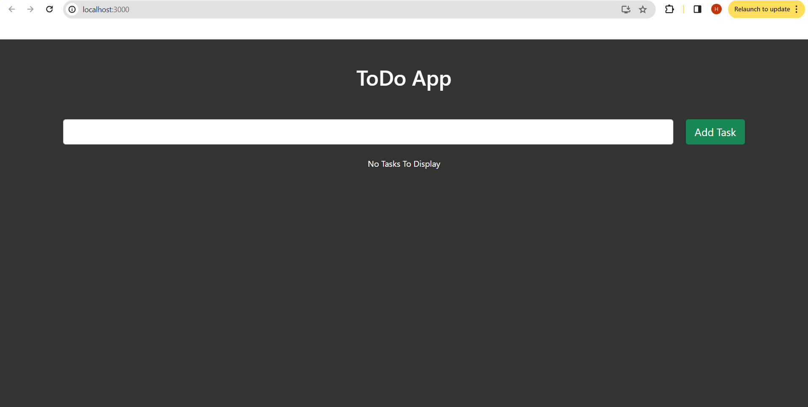
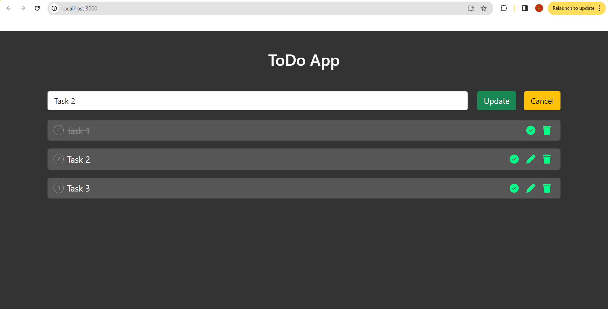

# ToDo App

## Overview
The ToDo App is a simple web application built using React.js that allows users to manage tasks. Users can add new tasks, edit existing tasks, mark tasks as completed, and delete tasks.

## Features
- User-friendly interface for managing tasks.
- Add new tasks.
- Edit task details.
- Mark tasks as completed.
- Delete tasks.

### Add Task

### Update Task

## Installation
1. Clone the repository:
   git clone https://github.com/Hafilu/To-Do.git

2. Navigate to the project directory:
   cd todo-app

3. Install project dependencies:
   npm install

4. Start the development server:
   npm start

The application should now be running on `http://localhost:3000`.

## Usage
- Open your web browser and go to `http://localhost:3000` to access the ToDo App.
- Add, edit, complete, and delete tasks as needed.

## Customization
You can customize the appearance and functionality of the ToDo App by modifying the React components and styles in the project. You can add features like task categories, due dates, and priority levels.

Feel free to contribute to or modify this project as needed.

Enjoy using your ToDo App!

  

 
